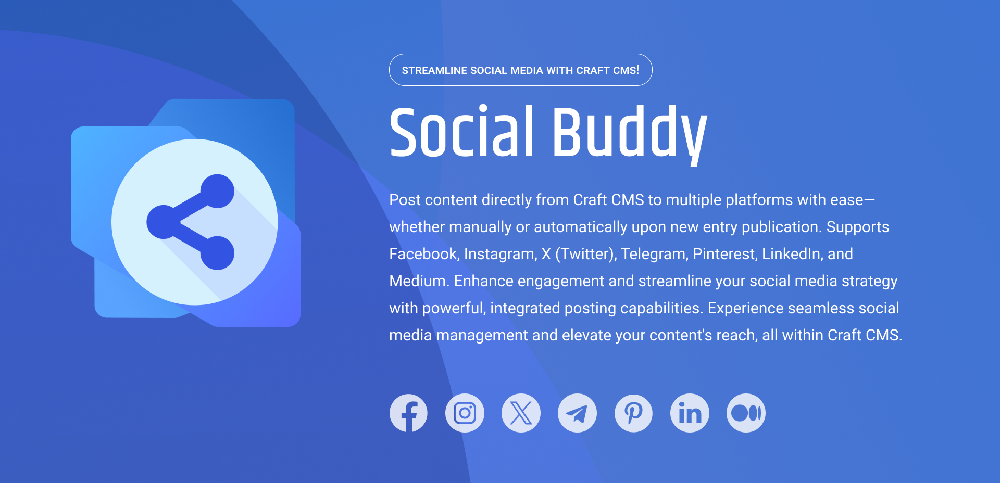

# Social Buddy for CraftCMS



Social Buddy is a CraftCMS plugin designed to streamline your social media publishing process. Effortlessly share your Craft entries as posts across multiple social media platforms, including Facebook, Instagram, Pinterest, Telegram, Medium, LinkedIn, and X (Twitter), directly from your Craft CMS (manual or automatic).

The plugin has three licensing levels depending on social media platforms supported:

- **FREE**: Facebook 
- **LITE**: FREE + Instagram, X(Twitter) 
- **PRO**: LITE + Pinterest, LinkedIn, Medium, Telegram

The plugin offers flexibility with two operating modes:

- **Automatic Mode**: Automatically publishes entries when their status changes to "Published" from a pending state.
- **Manual Mode**: Allows administrators to manually publish entries by clicking a "Publish" button, giving you precise control over what gets shared.

Before publishing, administrators need to connect the plugin to their social media accounts in the Settings section.

To enable automatic publishing, set up a cron job using the following command:

```bash
php craft element-status-events/scheduled
```

This ensures that your content is shared promptly and efficiently without manual intervention.

## Features

- **Multi-Platform Publishing**: Publish entries to popular social media platforms such as Facebook, Instagram, Pinterest, Telegram, Medium, LinkedIn, and X (Twitter).

- **Automatic & Manual Modes**: Choose between automatic publishing upon status changes or have full control with manual publishing.

- **Easy Social Media Integration**: Connect your social media accounts via the plugin's Settings section with straightforward instructions.

- **Cron Job Automation**: Set up cron jobs for automated publishing, ensuring your content is shared even when you're not around.

- **Customizable Post Content**: Tailor the content that gets posted to each social platform, including images, captions, and hashtags.

- **User-Friendly Interface**: Intuitive and clean interface that integrates seamlessly with your Craft CMS workflow.

- **Detailed Publishing Logs**: Keep track of published posts and any errors with comprehensive logging.

- **Multi-Account Support**: Manage and publish to multiple accounts on the same platform if needed.

- **Secure Authorization**: Robust security measures to protect your social media credentials and data.

## Requirements

- **Craft CMS 4.0.0 or later**
- **PHP 8.0.2 or later**
- **Social Media Accounts**: Valid accounts for each social media platform you wish to publish to.
- **Cron Job Access**: Ability to set up cron jobs on your hosting environment for automatic publishing.

## Installation

You can install this plugin from the Plugin Store or with Composer.

#### From the Plugin Store

1. Go to the Plugin Store in your project’s Control Panel.
2. Search for “Social Buddy”.
3. Click on the “Install” button in the plugin's modal window.

#### With Composer

Open your terminal and run the following commands:

```bash
# Navigate to your project directory
cd /path/to/my-project.test

# Require the plugin via Composer
composer require convergine/craft-social-buddy

# Install the plugin via Craft CLI
./craft plugin/install craft-social-buddy
```

## Configuration

After installation, configure the plugin by following these steps:

1. **Connect Social Media Accounts**: Navigate to the plugin’s Settings page and connect each social media platform by following the provided instructions.

2. **Set Publishing Preferences**: Choose between automatic and manual publishing modes, and configure content templates for each platform if desired.

3. **Set Up Cron Job (For Automatic Mode)**: Schedule the following command to run at your preferred intervals:

    ```bash
    php craft element-status-events/scheduled
    ```

    This ensures entries are published automatically when their status changes.

## Roadmap

- **Advanced Scheduling Options**: Ability to schedule posts for specific times per entry.

- **Analytics Integration**: View engagement metrics directly within the plugin dashboard.

- **Content Variations**: Customize posts differently for each social platform to maximize engagement.

- **Additional Platform Support**: Integration with more social media platforms based on user requests.

- **Team Collaboration Features**: Assign permissions and roles for team members to manage social postings.

## Support

For any issues or questions, you can reach us by email at [info@convergine.com](mailto:info@convergine.com) or by opening an issue on [GitHub](https://github.com/convergine/craft-social-buddy).